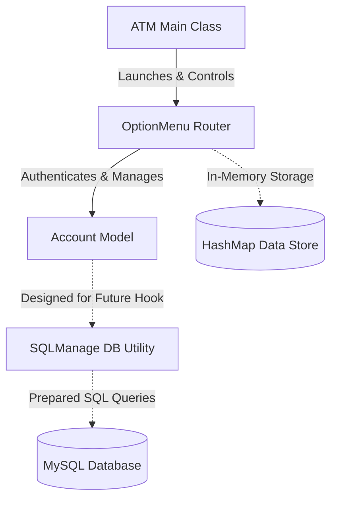

# ATM Machine Simulator

A comprehensive console-based **ATM (Automated Teller Machine) Simulator** implemented in Java. The application models standard banking interactions including user registration, secure login, account selection (Checking vs. Savings), balance inquiries, deposits, withdrawals, and inter-account transfers. It features structured in-memory management with a modular architecture prepared for database persistence.

---

## 🛠️ Tech Stack

*   **Language**: Java (JDK 8 or higher)
*   **Database Connectivity (Optional/Prepared)**: JDBC (Java Database Connectivity) for MySQL integration
*   **Storage (Simulation)**: In-Memory Java Collection Framework (`HashMap` structure) for transient state management
*   **Concepts**: Object-Oriented Programming (OOP), Exception Handling, and Type Validation

---

## 📐 System Design & Architecture

The system is designed using a clean separation of concerns, separating console input/output routers, business logic, user models, and data persistence utilities.

### Component Relationship Diagram



### Architectural Components

1.  **Entry Point (`com.main.repo.ATM`)**:
    *   Initiates the system.
    *   Hosts the application lifecycle loop to let users repeatedly return to the main menu.
2.  **Navigation Router (`com.option.repo.OptionMenu`)**:
    *   Facilitates interactive user session state (menus, input prompts, login validation).
    *   Maintains the register of in-memory simulated user accounts using a `HashMap`.
3.  **Domain Model (`com.account.repo.Account`)**:
    *   Represents a customer's checking and savings account balances.
    *   Encapsulates transaction business logic (withdrawing, depositing, checking limits, and transferring money between accounts).
4.  **Database Connection (`com.db.repo.SQLManage`)**:
    *   A database interaction utility helper. 
    *   Prepared to connect to a local MySQL instance using JDBC (`jdbc:mysql://localhost:3306/atm`) to fetch/save card pins, fetch user balances, insert transaction history logs (`dep` / `wit`), and register new user accounts.

---

## 💾 Database Schema (Optional MySQL Setup)

If you plan to switch the active persistence layer from in-memory `HashMap` to `SQLManage`, prepare a database named `atm` containing the following schemas:

### `users` Table
Stores user credentials and main balance.
```sql
CREATE TABLE users (
    id INT AUTO_INCREMENT PRIMARY KEY,
    card VARCHAR(50) UNIQUE NOT NULL,
    pin VARCHAR(10) NOT NULL,
    uname VARCHAR(100) NOT NULL,
    bal DECIMAL(15, 2) NOT NULL DEFAULT 0.00
);
```

### `transactions` Table
Logs all deposits and withdrawals with their closing balances.
```sql
CREATE TABLE transactions (
    transid INT AUTO_INCREMENT PRIMARY KEY,
    id INT NOT NULL,
    amount DECIMAL(15, 2) NOT NULL,
    stat VARCHAR(10) NOT NULL, -- 'dep' for Deposit, 'wit' for Withdraw
    bal DECIMAL(15, 2) NOT NULL,
    FOREIGN KEY (id) REFERENCES users(id) ON DELETE CASCADE
);
```

---

## 🚀 Key Features

*   **🔒 Security**: Simulates a PIN-based authentication scheme. Blocks alphanumeric character entries to prevent application crashes via robust try-catch exception handling.
*   **🆕 Account Registration**: Allows users to register a brand-new Customer Number and custom PIN in real-time.
*   **💳 Dual-Account Management**: Supports discrete management for both **Checking** and **Saving** balances.
*   **💸 Fund Transfers**: Enables seamless transfers from Checking to Saving and vice versa.
*   **📈 Validation Guardrails**: Restricts users from withdrawing beyond their account's limit (preventing negative balances).

---

## 🏃 Getting Started & Running the Project

### Prerequisites
*   **JDK 8** or newer installed.
*   Ensure Java paths are configured correctly on your machine.

### Execution

1.  **Compile the Java source files**:
    Navigate to the root directory and compile:
    ```bash
    javac -d bin src/com/main/repo/ATM.java src/com/option/repo/OptionMenu.java src/com/account/repo/Account.java src/com/db/repo/SQLManage.java
    ```
2.  **Run the application**:
    ```bash
    java -cp bin com.main.repo.ATM
    ```

### In-Memory Accounts Configured by Default
*   **Customer ID**: `123` | **PIN**: `123`
*   **Customer ID**: `952141` | **PIN**: `2023`
